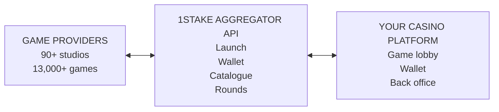

# 🎰 1Stake Casino Game Aggregator API

Connect your online casino to **90+ game providers and 13,000+ casino games** through a single integration. The **1Stake Casino API** provides game aggregation, seamless wallet integration, game launch, catalogue synchronisation and round reporting for iGaming operators and platform developers.

> [API OVERVIEW](https://1stake.app/products/casino-api?utm_source=github&utm_medium=referral&utm_campaign=api_readme)
> • [GAME PROVIDERS](https://1stake.app/products/casino-platform/game-providers?utm_source=github&utm_medium=referral&utm_campaign=api_readme)
> • [REQUEST API ACCESS](https://1stake.app/contact-us?utm_source=github&utm_medium=referral&utm_campaign=api_readme)

---

## What Is a Casino Game Aggregator API?

A **casino game aggregator API** connects an online casino platform to multiple game providers through one interface. It reduces the development and maintenance work required to manage separate provider integrations and wallet protocols.

1Stake connects your platform to a network of 90+ game providers through a single integration. Your developers use a shared API for game launch, wallet transactions, catalogue updates and round reporting.

---

## 🧩 Casino API Features

### Seamless Wallet Integration

- Keep player balances in your platform's wallet.
- Process provider wallet operations through signed server-to-server callbacks.
- Support **balance**, **bet**, **win** and **rollback** operations.

### Game Launch

- Send the player ID, currency, language and device type in a launch request.
- Receive a **game session URL** to open from your casino lobby.
- Support desktop and mobile game launches.

### Game Catalogue Synchronisation

- Retrieve game names, categories, thumbnails and return-to-player (RTP) information.
- Keep your game lobby and provider directory up to date through catalogue synchronisation.

### Round Reporting and Reconciliation

- Review game rounds and their associated transactions.
- Reconcile your ledger with provider data to support gross gaming revenue (GGR) reporting.

### Sandbox Testing

- Test game launches and wallet flows using sandbox players and balances.
- Run automated integration checks before moving to production.

### API Security and Transaction Handling

- Signed requests and **IP allowlisting**.
- **Idempotent transactions** to prevent duplicate processing when requests are retried.
- Rate limiting and HTTPS transport.

---

## 🔌 Casino API Integration

The API uses versioned **JSON endpoints over HTTPS**, explicit error codes and unique transaction IDs for reconciliation and retry handling. Sandbox players, balances and test scenarios support integration testing.

### Integration Process

1. **Confirm requirements and access.** Share your platform requirements and preferred providers, then agree on commercial terms. Receive API documentation, sandbox credentials and engineering support.
2. **Implement the integration.** Connect game launch, wallet callbacks (`balance`, `bet`, `win` and `rollback`) and catalogue synchronisation. Test these flows in the sandbox.
3. **Validate transaction flows.** Complete automated checks for game launch, wallet operations and round reporting. Our team reviews the results before production access is enabled.
4. **Launch in production.** Switch to production credentials and endpoints, and make your selected games available in your lobby with ongoing technical support.

---

## 🎮 Casino Game Providers and Categories

The 1Stake catalogue includes **slots, live casino, table games, instant games, crash games and virtual sports**. Choose providers and game categories to suit your market and audience.

Browse the [supported casino game providers](https://1stake.app/products/casino-platform/game-providers?utm_source=github&utm_medium=referral&utm_campaign=api_readme) and contact us to confirm availability for your project.

---

## Frequently Asked Questions

### Which casino game providers are available?

> See the [game provider directory](https://1stake.app/products/casino-platform/game-providers?utm_source=github&utm_medium=referral&utm_campaign=api_readme). For a specific studio or game category, [contact us](https://1stake.app/contact-us?utm_source=github&utm_medium=referral&utm_campaign=api_readme) to confirm availability.

### How does seamless wallet integration work?

> Player balances remain in your system. Provider balance checks, bets, wins and rollbacks are processed through signed callbacks to your wallet endpoints.

### Can we test the casino API before launch?

> Yes. Sandbox players and balances let you test game launches and wallet transactions. Complete the integration checks and review before moving to production.

### How do we get API documentation and credentials?

> [Request API access](https://1stake.app/contact-us?utm_source=github&utm_medium=referral&utm_campaign=api_readme) to discuss your integration requirements. Documentation and sandbox credentials are provided during onboarding.

### How is casino API access priced?

> Casino API access is a paid service. [Tell us about your project](https://1stake.app/contact-us?utm_source=github&utm_medium=referral&utm_campaign=api_readme) to discuss pricing, commercial terms and integration requirements.

### Does 1Stake offer a turnkey casino solution?

> Yes. The [1Stake turnkey casino solution](https://1stake.app/solutions/turnkey-casino?utm_source=github&utm_medium=referral&utm_campaign=api_readme) combines a casino front end, game content, payment integrations and back-office tools in a ready-to-deploy platform. Explore the [online casino platform overview on GitHub](https://github.com/1stake/online-casino-platform) for platform features and integrations.

---

## 🚀 Request Casino API Access

Use one provider integration, retain control of player balances and validate transaction flows before launch. Our engineers support your team through onboarding, testing and production integration.

[Contact the 1Stake team](https://1stake.app/contact-us?utm_source=github&utm_medium=referral&utm_campaign=api_readme) to discuss game providers, pricing and API access.

---

Developed and supported by the [1Stake iGaming Software Development Team](https://1stake.app/?utm_source=github&utm_medium=referral&utm_campaign=api_readme).
