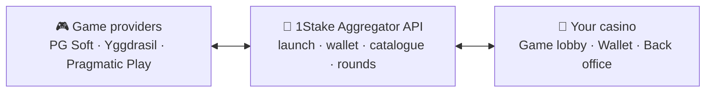

# 🎰 1Stake Casino Game Aggregator API
One integration, 90+ game studios and 12,000+ casino games. A developer-friendly **casino game aggregator API** with seamless wallet, game launch and catalogue sync for iGaming operators.

> [API OVERVIEW](https://1stake.app/products/casino-api?utm_source=github&utm_medium=referral&utm_campaign=api_readme)
> • [GAME PROVIDERS](https://1stake.app/products/casino-platform/game-providers?utm_source=github&utm_medium=referral&utm_campaign=api_readme)
> • [CONTACT US](https://1stake.app/contact-us?utm_source=github&utm_medium=referral&utm_campaign=api_readme)

---

## 🧩 What Is a Casino Game Aggregator?

Connecting an online casino directly to every game studio means a separate technical integration, a separate wallet protocol and a separate commercial agreement for each one.
That work grows with every provider you add and slows down your content roadmap.

A **game aggregator** replaces those point-to-point integrations with a single one.
The **1Stake Casino API** sits between top-tier studios such as Pragmatic Play, PG Soft and Yggdrasil and your platform.
Your developers build against one documented interface and get access to **90+ game providers and 12,000+ games**.



> 👉 Learn more on the [Casino Game Aggregator API page](https://1stake.app/products/casino-api?utm_source=github&utm_medium=referral&utm_campaign=api_readme).

---

## ✨ Key Features

### 💰 Seamless Wallet
- Player funds stay on **your** platform – no balance transfers to third parties
- Providers call your wallet endpoints via signed server-to-server callbacks
- Supported operations: **balance**, **bet**, **win** and **rollback**

### 🚀 Game Launch
- Send player ID, currency, language and device type in a single request
- Receive a ready-to-embed **game session URL**
- Works across desktop and mobile lobbies

### 📚 Game Catalogue Sync
- Pull game names, categories, thumbnails and RTP details
- Keep your lobby and provider directory up to date without manual uploads

### 📊 Round Reporting & Reconciliation
- Inspect every game round together with its underlying transactions
- Reconcile your ledger against provider data for accurate GGR reporting

### 🧪 Sandbox Environment
- Test launches and wallet flows with sandbox players and balances
- Run automated integration checks before you request production access

### 🛡️ Integration Safeguards
- Signed requests and **IP allowlisting**
- **Idempotent transactions** for safe retries
- Rate limiting and HTTPS-only transport

---

## 👨‍💻 For Developers

The API is designed to be predictable, testable and easy to reconcile:

- Versioned **JSON endpoints over HTTPS**
- Explicit error codes for every failure mode
- Unique transaction IDs, so retries never double-charge or double-credit a player
- Sandbox players, balances and test scenarios

**Example: wallet bet callback** *(illustrative payloads – the full specification is provided with API access)*

```http
POST /v1/wallet/bet
```

```json
{
  "transaction_id": "tx_9f3a1c",
  "round_id": "r_20418",
  "player_id": "p_48213",
  "amount": 2.00,
  "currency": "EUR"
}
```

```json
{
  "status": "ok",
  "balance": 123.40
}
```

Because `transaction_id` is idempotent, replaying the same request returns the original result instead of debiting the player twice.

---

## 🛠️ Integration Process

1. **🤝 Discuss access** – Share your requirements with us and agree on commercial terms. You receive API documentation, sandbox credentials and engineering support.
2. **🔌 Integrate** – Implement game launch, wallet callbacks (balance / bet / win / rollback) and catalogue sync, then test everything in the sandbox.
3. **✅ Verify** – Automated integration tests cover launch, wallet and round flows. Our team reviews the results before you go to production.
4. **🚀 Go live** – Switch to production keys and endpoints. Your selected games appear in your lobby, with ongoing technical support from our team.

---

## 🎮 Game Provider Network

Our aggregator connects **90+ studios** into one catalogue, so you can build a lobby that matches your market and audience.

> 👉 Browse the [full list of supported game providers](https://1stake.app/products/casino-platform/game-providers?utm_source=github&utm_medium=referral&utm_campaign=api_readme).

---

## ❓ FAQ

**Which game providers are available?**
See the [provider directory](https://1stake.app/products/casino-platform/game-providers?utm_source=github&utm_medium=referral&utm_campaign=api_readme). If you need a specific studio or game type, [contact us](https://1stake.app/contact-us?utm_source=github&utm_medium=referral&utm_campaign=api_readme) to confirm availability.

**How does the wallet integration work?**
It is a seamless (single-wallet) model: funds remain in your system, and providers check balances and record bets, wins and rollbacks through signed callbacks.

**Can we test before going live?**
Yes. Use sandbox players and balances, then complete the automated integration checks to unlock production access.

**How is the API priced?**
Casino API access is a paid service. [Tell us about your project](https://1stake.app/contact-us?utm_source=github&utm_medium=referral&utm_campaign=api_readme) and we will explain pricing and integration steps before you commit.

**Can I combine the API with a full casino platform?**
Yes. If you need a complete front end and back office rather than just content, take a look at our [turnkey casino platform](https://1stake.app/products/casino-platform?utm_source=github&utm_medium=referral&utm_campaign=api_readme).

---

## ✅ Why Choose the 1Stake Game Aggregator?

- 🔌 One integration instead of dozens of studio-specific ones
- ⚡ Faster time-to-market for new games and brands
- 💼 Player funds stay under your control
- 🔐 Signed, idempotent and rate-limited API contract
- 🧪 Sandbox and automated checks to de-risk your launch
- 🤝 Hands-on integration support from our engineers

> 🚀 Integrate once. Offer thousands of games.

> 👉 [Request API access](https://1stake.app/contact-us?utm_source=github&utm_medium=referral&utm_campaign=api_readme)

---

Created and supported with ❤️ by the [1Stake iGaming Software Development Team](https://1stake.app/?utm_source=github&utm_medium=referral&utm_campaign=api_readme)
